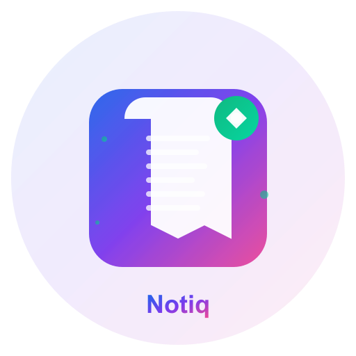
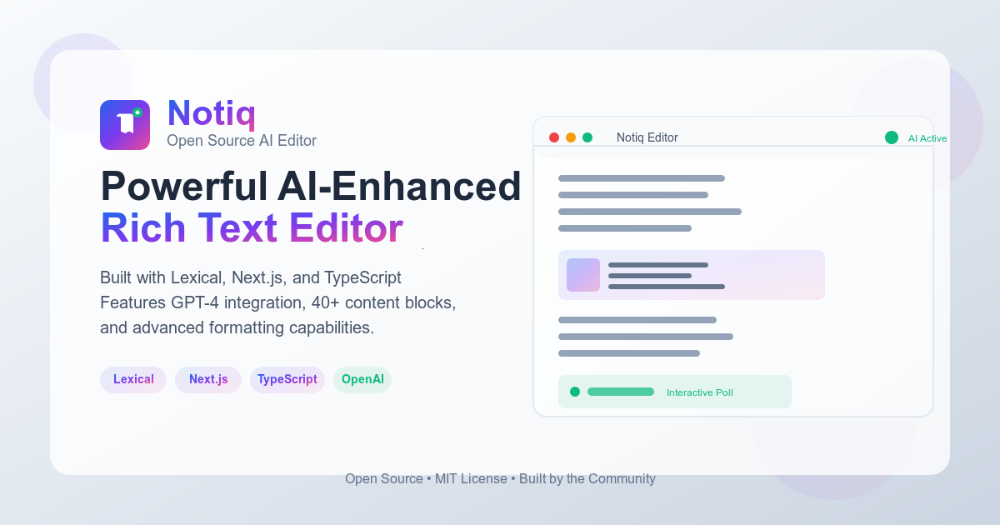
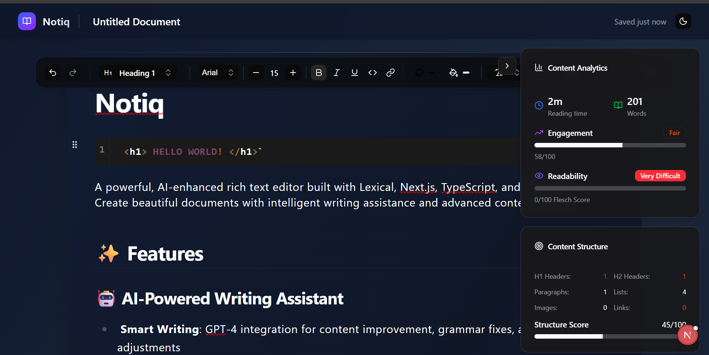
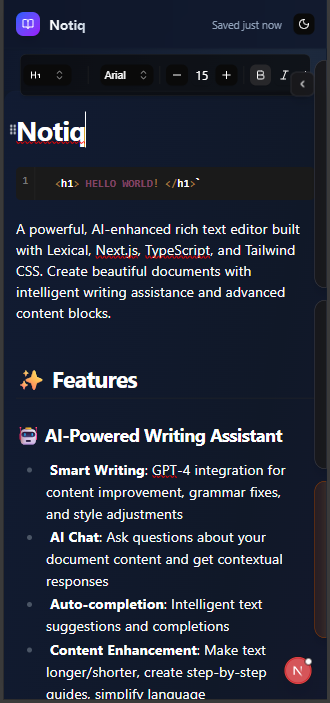

<div align="center">
  
  <h1>Notiq</h1>
  <p>
    <strong>A powerful, AI-enhanced rich text editor built with Lexical, Next.js, TypeScript, and Tailwind CSS.</strong>
  </p>
  <p>
    Create beautiful documents with intelligent writing assistance and advanced content blocks.
  </p>
</div>



## 📸 Screenshots

<div align="center">
  <h3>Desktop View</h3>
  
</div>

<div align="center">
  <h3>Mobile View</h3>
  
</div>

## ✨ Features

### 🤖 AI-Powered Writing Assistant
- **Smart Writing**: GPT-4 integration for content improvement, grammar fixes, and style adjustments
- **AI Chat**: Ask questions about your document content and get contextual responses
- **Auto-completion**: Intelligent text suggestions and completions
- **Content Enhancement**: Make text longer/shorter, create step-by-step guides, simplify language

### ✏️ Rich Text Editor
- **Lexical Framework**: Built on Facebook's modern Lexical editor framework
- **WYSIWYG Editing**: What-you-see-is-what-you-get editing experience
- **Markdown Support**: Full markdown shortcuts and live transformers
- **Slash Commands**: Type "/" for quick content insertion and formatting
- **Floating Toolbars**: Context-sensitive formatting tools

### 🧩 Advanced Content Blocks
- **Media**: Images, inline images, YouTube videos, Twitter embeds
- **Interactive**: Polls, step-by-step guides, collapsible sections
- **Technical**: Code blocks with syntax highlighting, mathematical equations (KaTeX)
- **Design**: Excalidraw drawings, Figma embeds
- **Layout**: Multi-column layouts, resizable panels, tables
- **Callouts**: Hint blocks and special callout sections

### 🎨 User Experience
- **Drag & Drop**: Draggable blocks and content reordering
- **Speech-to-Text**: Voice input capabilities
- **Link Previews**: Rich link previews with metadata
- **Theme Support**: Dark/light mode with seamless switching
- **Keyboard Shortcuts**: Comprehensive shortcut system
- **Real-time Collaboration**: Shared editing context

## 🚀 Library Usage

Notiq can be used as a standalone editor in your React/Next.js projects.

### Installation

```bash
npm install @collabchron/notiq
```

### Integration

#### 1. Import Styles

Import the CSS file in your root layout file (e.g., `app/layout.tsx` or `pages/_app.tsx`):

```tsx
import "@collabchron/notiq/styles.css";
```

#### 2. Usage in your component

```tsx
"use client";

import { Editor } from "@collabchron/notiq";

export default function MyEditorPage() {
  return (
    <Editor 
      isEditable={true}
      aiConfig={{
        apiEndpoint: "/api/ai", // Your AI completion endpoint
      }}
      uploadConfig={{
        uploadHandler: async (file) => {
          // Your custom upload logic (e.g., S3, Cloudinary)
          return { url: "https://your-storage.com/file.png" };
        }
      }}
    />
  );
}
```

## 🛠️ Local Development

If you want to contribute or run the development environment:

### Installation

```bash
npm install

# or

yarn install

# or

pnpm install
```

### Environment Setup

Create a `.env.local` file with your API keys:

```env
OPENAI_API_KEY=your_openai_api_key_here

NEXT_PUBLIC_EDGESTORE_ACCESS_KEY=your_edgestore_key

NEXT_PUBLIC_EDGESTORE_SECRET_KEY=your_edgestore_secret
```

### Development

```bash
npm run dev

# or

yarn dev

# or

pnpm dev
```

Open [http://localhost:3000](http://localhost:3000) to start writing!

## 🏗️ Architecture

### Core Components

- **Editor Core** (`/src/components/editor/Core.tsx`) - Main editor container with Lexical integration
- **Plugins** (`/src/components/editor/plugins/`) - 40+ feature plugins for rich functionality
- **Nodes** (`/src/components/editor/nodes/`) - 20+ custom content block types
- **AI Integration** (`/src/components/ui/ai/`) - AI-powered writing assistance
- **Toolbar System** - Rich formatting toolbar with contextual actions

### Plugin System

Notiq uses an extensible plugin architecture:

```tsx
import { Editor } from '@/components/editor'

function MyApp() {
  return (
    <Editor
      plugins={[
        // Built-in plugins
        'toolbar',
        'slash-commands',
        'ai-assistant',
        'drag-drop',
        // Custom plugins
        MyCustomPlugin
      ]}
    />
  )
}
```

## 🎯 Use Cases

- **Documentation**: Technical docs, API references, user guides
- **Content Creation**: Blog posts, articles, marketing content
- **Note-taking**: Personal notes, meeting minutes, research
- **Collaborative Writing**: Team documents, shared knowledge bases
- **Educational Content**: Tutorials, courses, interactive lessons

## 🛠️ Development

### Adding Custom Nodes

```tsx
import { DecoratorNode } from 'lexical'

export class MyCustomNode extends DecoratorNode<JSX.Element> {
  static getType(): string {
    return 'my-custom-node'
  }
  
  createDOM(): HTMLElement {
    return document.createElement('div')
  }
  
  decorate(): JSX.Element {
    return <MyCustomComponent />
  }
}
```

### Creating Plugins

```tsx
import { useLexicalComposerContext } from '@lexical/react/LexicalComposerContext'

export function MyPlugin() {
  const [editor] = useLexicalComposerContext()
  
  // Plugin logic here
  
  return null
}
```

## 📦 Building for Production

```bash
npm run build
npm run start
```

## 🤝 Contributing

We welcome contributions! Please see our [Contributing Guidelines](CONTRIBUTING.md) for details on how to get started, submitting bug reports, and suggesting enhancements.

Please note that this project is released with a [Contributor Covenant Code of Conduct](CODE_OF_CONDUCT.md). By participating in this project you agree to abide by its terms.

## 📄 License

MIT License - see the [LICENSE](LICENSE) file for details.

## 🆘 Support

- 📖 [Documentation](https://github.com/chinonsochikelue/notiq)
- 🐛 [Report Issues](https://github.com/chinonsochikelue/notiq/issues)
- 💬 [Discussions](https://github.com/chinonsochikelue/notiq/discussions)

---

Built with ❤️ using [Lexical](https://lexical.dev/), [Next.js](https://nextjs.org/), and [OpenAI](https://openai.com/)
