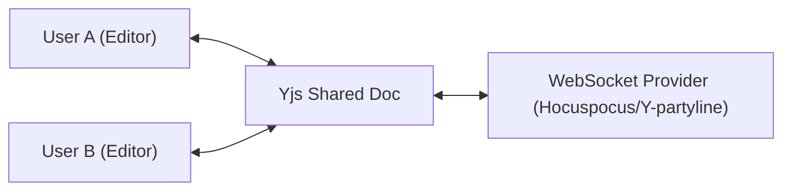

# Real-time Collaboration

Notiq is built on the **Lexical** editor framework, which is natively designed for high-performance real-time collaboration. While Notiq doesn't ship with a built-in collaboration server, it is fully "Collaboration-Ready."

## Architecture

To enable real-time collaboration, Notiq uses a shared state model powered by [Yjs](https://yjs.dev/), a high-performance CRDT (Conflict-free Replicated Data Type) library.



## Setup Guide

To implement collaboration, follow these steps:

### 1. Install Dependencies

```bash
pnpm add @lexical/yjs yjs y-websocket
```

### 2. Configure the Collaboration Plugin

You will need to wrap your editor or register the `CollaborationPlugin` within the Lexical scope.

```tsx
import { CollaborationPlugin } from '@lexical/react/LexicalCollaborationPlugin';
import * as Y from 'yjs';
import { WebsocketProvider } from 'y-websocket';

function MyCollaborationPlugin() {
  const doc = new Y.Doc();
  const provider = new WebsocketProvider('ws://localhost:1234', 'my-room', doc);

  return (
    <CollaborationPlugin
      id="my-collaboration-plugin"
      providerFactory={(id, yjsDocMap) => {
        return provider;
      }}
      shouldBootstrap={true}
    />
  );
}
```

### 3. User Presence (Cursors)

To show where other users are typing, you can use the `cursor` plugin feature of `@lexical/yjs`. This allows you to render colored carets and usernames for every connected collaborator.

## Key Concepts

- **Shared History**: Notiq uses `SharedHistoryContext` to ensure that undo/redo actions are synchronized across all users without conflicting with local changes.
- **Conflict Resolution**: Yjs handles merging changes automatically, even if users are offline and reconnect later.
- **Persistence**: You can persist the Yjs document to a database (like Redis or Postgres) on your server to ensure data is never lost.

> [!NOTE]
> For a production-ready collaboration server, we recommend using [Hocuspocus](https://tiptap.dev/hocuspocus), which provides robust persistence and authentication hooks for Yjs.
